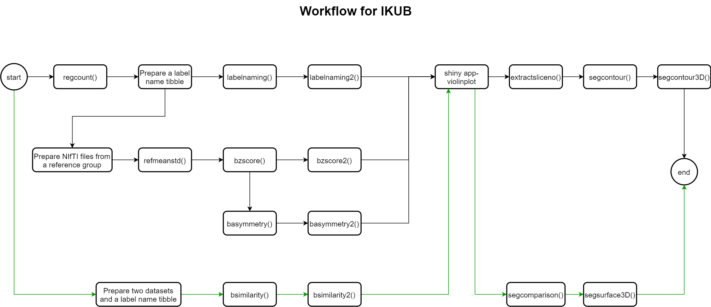

```{r setup, include=FALSE}
knitr::opts_chunk$set(echo = TRUE)
```
```{R include=FALSE}
require(neurobase)
require(IKUB)
require(EBImage)
require(rgl)
require(misc3d)
```

<style type="text/css">

body, td {
   font-size: 14px;
}
code.r{
  font-size: 14px;
}
pre {
  font-size: 14px
}
</style>
The 'IKUB' package includes functions that interact with MR brain images of class 'NIfTI', implemented by package 'oro.nifti', and their segmentations as input in order to produce image visualizations, data visualizations and statistical analyses. 

The author made use of the Hammers Atlas Database, © Imperial College of Science, Technology and Medicine 2007. All rights reserved. The resource is available from www.brain-development.org [1]–[4]. In the demonstrations of function `segcomparison()` and `segcomparison3D()`, NIfTI files generated by MAPER [5] were used in order to compare segmentation regions differences. **Due to copyright issues, all examples in this documentation do not return output. Users can download the atlas from the above link and use the relevant functions to return the results. This package should not be used for clinical diagnosis.** 

The suggested workflow for using developed functions in this package is attached at the end of this document for users' reference.  

The packages and versions of packages used in this package are as follows.
```
dplyr (1.0.5)
EBImage (4.32.0)
graphics (4.0.4)
grDevices (4.0.4)
magrittr (2.0.1)
misc3d (0.9-0)
neurobase (1.29.0)
plyr (1.8.6)
purrr (0.3.4)
rgl (0.105.22)
stats (4.0.4)
tibble (3.1.1)
tidyr (1.1.3)
```
Users can install the development version of IKUB from [GitHub](https://github.com/) with:

```{r, eval=FALSE, warning=FALSE}
# Install the devtools package
install.packages('devtools')
# Install the IKUB package
devtools::install_github("yupingikub/IKUB", build_vignettes = TRUE, force=TRUE)
```

Please install the following packages before using the IKUB package:

```{r, eval=FALSE, warning=FALSE}
# Install packages from CRAN
install.packages(c('tidyverse', 'oro.nifti', 'neurobase', 'rgl', 'misc3d')
# Installation of EBImage package
install.packages("BiocManager")
BiocManager::install("EBImage")
```

### `basymmetry()`

Brain asymmetry index $A_r$ is calculated using the following equation:

$$A_r=\frac{2|V_R-V_L|}{V_R+V_L}$$
where:

$V_R$ is the volume of the right brain region.

$V_L$ is the volume of the left brain region.

The function calculates asymmetry index/indices for one or more supplied NIfTI-files. It takes as input a label name tibble with correct format and unique label numbers and label names. Option one returns one or more asymmetry indices for whole brain for supplied NIfTI-file(s). Option two returns asymmetry indices for the left and right regions for supplied NIfTI-file(s).  

<b>Usage:</b>
```
basymmetry(filename, labelnametibble, option)
```
<b>Arguments:</b>

- filename: One or more NIfTI-files.

- labelnametibble: A label name tibble with correct format and unique columns. First column of the label name tibble should contain an integer label number and second column should contain a label name string. Label numbers and label names must be unique. The trailing characters of label names must be R or L.

- option: 1: Returns asymmetry indices for whole brain. 2: Returns asymmetry indices for the left and right regions. Default is 1.

```{r basymmetry1, eval=FALSE, warning=FALSE}
# option=1
basymmetry(c('a01-seg.nii.gz','a02-seg.nii.gz'),labelnametibble, 1)
```
```{r basymmetry2, eval=FALSE, warning=FALSE}
# option=2
basymmetry(c('a01-seg.nii.gz','a02-seg.nii.gz'),labelnametibble, 2)
```
### `basymmetry2()`
Takes a label name tibble with correct format and unique label numbers and label names. First column of the label name tibble should be an integer label number and second column should be a label name string. The trailing characters of label names must be R or L. The function returns asymmetry index/indices for one or more supplied NIfTI-files. The generated output must be exported to CSV format in order to be made available for further analysis in shiny app-violinplot. 

<b>Usage:</b>
```
basymmetry2(filename, labelnametibble)
```
<b>Arguments:</b>

- filename: One or more NIfTI-files.

- labelnametibble: A label name tibble with correct format and unique columns. First column of the label name tibble should contain an integer label number and second column should contain a label name string. Label numbers and label names must be unique. The trailing characters of label names must be R or L.

```{r basymmetry3, eval=FALSE, warning=FALSE}
filename <- c(paste('a0', 1:9, '-seg.nii.gz', sep=''), paste('a', 10:30, '-seg.nii.gz', sep=''))
output <- basymmetry2(filename, labelnametibble)
# Gets a temporary directory to store the CSV file in.
path <- tempdir()
# Name of the CSV file that the output will be stored in.
file_n <- 'asymmetry'
file_p <- file.path(path, paste0(file_n, ".csv"))
# Exports the output from basymmetry2 function to a CSV file. 
write.csv(output, file_p, row.names = FALSE, na = "NA")
```

### `bsimilarity()`
Calculates Dice coefficients and Jaccard indices for a supplied NIfTI file pair. Only regions which are in the label name tibble, target labels will be included in the result.

<b>Usage:</b>
```
bsimilarity(filename1, filename2, labelnametibble)
```

<b>Arguments:</b>

- filename1: A filename for one NIfTI-file.

- filename2: A filename for one NIfTI-file.

- labelnametibble: A label name tibble with correct format and unique columns. First column of the label name tibble should contain an integer label number and second column should contain a label name string. Label numbers and label names must be unique.

```{r bsimilarity, eval=FALSE, warning=FALSE}
bsimilarity('a01-seg.nii.gz', 'a1.nii.gz', labelnametibble)
```
### `bsimilarity2()`
The function is used to generate Jaccard indices for all regions for one or more file pairs. The generated output must be exported to CSV format in order to be made available for further analysis in shiny app-violinplot. 

<b>Usage:</b>
```
bsimilarity2(filename1, filename2, labelnametibble)
```
<b>Arguments:</b>

- filename1: One or more NIfTI-files.

- filename2: One or more NIfTI-files.

- labelnametibble: A label name tibble with correct format and unique columns. First column of the label name tibble should contain an integer label number and second column should contain a label name string. Label numbers and label names must be unique.

```{r bsimilarity2, eval=FALSE, warning=FALSE}
filename1 <- c(paste('a0', 1:9, '-seg.nii.gz', sep=''), paste('a', 10:30, '-seg.nii.gz', sep=''))
filename2 <- c(paste('a', 1:30, '.nii.gz', sep=''))
output <- bsimilarity2(filename1, filename2, labelnametibble)
# Gets a temporary directory to store the CSV file in.
path <- tempdir()
# Name of the CSV file that the output will be stored in.
file_n <- 'Jaccardindex'
file_p <- file.path(path, paste0(file_n, ".csv"))
# Exports the output from bsimilarity2 function to a CSV file. 
write.csv(output, file_p, row.names = FALSE, na = "NA")
```
### `bzscore()`
Converts a raw score x into a Standard score (Z-score) using the following equation:

$$z=\frac{x-\mu}{\sigma}$$

where:

$\mu$ is the mean of the reference group.

$\sigma$ is the standard deviation of the reference group.

Calculates z-scores of all regions. Inputs one or more NIfTI-files from one or more individuals, for which Z-scores are to be calculated, a label name tibble and a tibble including mean values and standard deviations from the reference group for one or more individuals. Returns Z-scores with label names for regions which are in the label name tibble. 

<b>Usage:</b>
```
bzscore(filename, labelnametibble, refstats)
````
<b>Arguments:</b>

- filename: One or more NIfTI-files for individuals from which z-scores are to be calculated.

- labelnametibble: A label name tibble.

- refstats: A tibble which was previously calculated by the refmeanstd function.

```{r bzscore, eval=FALSE, warning=FALSE}
# Restore refstats tibble saving in computer
refstats <- readRDS("refstats.rds")
bzscore(c('a01-seg.nii.gz', 'a02-seg.nii.gz'), labelnametibble, refstats)
```
### `bzscore2()`
Calculates Z-scores of all regions. Inputs one or more NIfTI-files from one or more individuals, for which Z-scores are to be calculated, a label name tibble and a tibble including mean values and standard deviations from the reference group for one or more individuals. Generates output including Z-scores with label names for regions which are in the label name tibble. The generated output must be exported to CSV format in order to be made available for further analysis in shiny app-violinplot. 

<b>Usage:</b>
```
bzscore2(filename, labelnametibble, refstats)
````
<b>Arguments:</b>

- filename: One or more NIfTI-files for individuals from which z-scores are to be calculated

- labelnametibble: A label name tibble.

- refstats: A tibble which was previously calculated by the refmeanstd function.

```{r bzscore2, eval=FALSE, warning=FALSE}
filename <- c(paste('a0', 1:9, '-seg.nii.gz', sep=''), paste('a', 10:30, '-seg.nii.gz', sep=''))
output <- bzscore2(filename, labelnametibble, refstats)
# Gets a temporary directory to store the CSV file in.
path <- tempdir()
# Name of the CSV file that the output will be stored in.
file_n <- 'zscore'
file_p <- file.path(path, paste0(file_n, ".csv"))
# Exports the output from bzscore2 function to a CSV file. 
write.csv(output, file_p, row.names = FALSE, na = "NA")
```

### `check_label()`
Checks if Label_No and Label_name columns exist. Checks if label number is an integer and if there are any duplicate label numbers or label names in the tibble. First column of the label name tibble must contain an integer label number and the second column must contain a label name string. Label numbers and label names must be unique. Returns an error message or a label name tibble. 

### `check_label_RGB()`
Checks if Label_No, Label_name, R, G and B columns exist. Checks if label number is an integer and if there are any duplicate label numbers or label names in the tibble. First column of the label name tibble must contain an integer label number and the second column must contain a label name string. Label numbers and label names must be unique. Returns an error message or a label name tibble. 

### `element_count()`
Calculates total number of counts in both images and counts for overlap. Inputs one slice number and one label number. The function calculates counts for total number of pixels in both images, pixels for overlap, pixels only in image1 and pixels only in image2 in the given slice for the given label number. This function is primarily used by other functions.

### `extractsliceno()`
Extracts slice numbers for one or more supplied label numbers and anatomical plane. Users input one NIfTI-file and one or more target label numbers and anatomical plane. The function returns slice numbers which include supplied target label(s) for supplied anatomical plane.

<b>Usage:</b>
```
extractsliceno(filename, target_label, anatomical_plane)
```
<b>Arguments:</b>

- filename: One NIfTI-file.

- target_lable: One target label number.

- anatomical_plane: 1 for coronal plane, 2 for sagittal plane and 3 for transverse plane. Default is 3.

```{r extractsliceno, eval=FALSE, warning=FALSE}
extractsliceno('a01-seg.nii.gz', 15:16)
```

### `files_element()`
Inputs a file pair. The function returns total number of counts in both images and counts for overlap, counts only in image1, counts only in image2 for given filenames. This function is primarily used by other functions.

### `labelnaming()`
Calculates volumes for all regions with label name. User inputs one or more NIfTI-files and a label name tibble. Returns total volumes, with label names, for all regions in the supplied NIfTI-file(s). A label name tibble must have correct format and unique columns. First column of the label name tibble must contain an integer label number and second column must contain a label name string. Label numbers and label names must be unique. Only regions which are in the label name tibble will be included in the result. 

<b>Usage:</b>
```
labelname(filename,labelnametibble)
````
<b>Arguments:</b>

- filename: One or more NIfTI-files.

- labelnametibble: A label name tibble.

```{r labelnaming, eval=FALSE, warning=FALSE}
labelnaming(c('a01-seg.nii.gz', 'a02-seg.nii.gz'), labelnametibble)
```

### `labelnaming2()`
Calculates volumes for all regions with label names. User inputs one or more NIfTI-files and a label name tibble. Saves total volumes, with label names, for all regions in the supplied NIfTI-file in a csv file in the working directory. A label name tibble must have correct format and unique columns. First column of the label name tibble must contain an integer label number and second column must contain a label name string. Label numbers and label names must be unique. Only regions which are in the label name tibble will be included in the result. The generated output must be exported to CSV format in order to be made available for further analysis in shiny app-violinplot. 

<b>Usage:</b>
```
labelname2(filename,labelnametibble)
````
<b>Arguments:</b>

- filename: One or more NIfTI-files.

- labelnametibble: A label name tibble.

```{r labelnaming2, eval=FALSE, warning=FALSE}
filename <- c(paste('a0', 1:9, '-seg.nii.gz', sep=''), paste('a', 10:30, '-seg.nii.gz', sep=''))
output <- labelnaming(filename, labelnametibble)
# Gets a temporary directory to store the CSV file in.
path <- tempdir()
# Name of the CSV file that the output will be stored in.
file_n <- 'brainvolume'
file_p <- file.path(path, paste0(file_n, ".csv"))
# Exports the output from labelnaming2 function to a CSV file. 
write.csv(output, file_p, row.names = FALSE, na = "NA")
```

### `refmeanstd()`
Calculates mean and standard deviation for all regions in a reference group. Reference group must contain at least two NIfTI-files. Returns the mean values and standard deviations for all regions.

<b>Usage:</b>
```
refmeanstd(filename)
````
<b>Arguments:</b>

- filename: At least two NIfTI-file filenames.

Generating the refstats tibble from a certain reference group and saving it will allow for reuse across sessions that uses the same reference group which will save time and effort.
```{r refmeanstd, eval=FALSE, warning=FALSE}
reflabels<-c(paste('a0', 1:9, '-seg.nii.gz', sep=''), paste('a', 10:29, '-seg.nii.gz', sep='') )
refstats <- refmeanstd(reflabels)
head(refstats,6)
```
```{r, eval=FALSE}
# Gets a temporary directory to store the RDS file in.
path <- tempdir()
# Name of the RDS file that the output will be stored in.
file_n <- 'refstats'
file_p <- file.path(path, paste0(file_n, ".rds"))
# Use function saveRDS() to save refstats tibble in an RDS file. 
saveRDS(refstats, file=file_p)
```

### `regcount()`
Calculates total counts and total volumes for all regions in the supplied NIfTI-file. 

<b>Usage:</b>
```
regcount(filename)
````
<b>Arguments:</b>

- filename: A NIfTI-file filename.


```{r regcount, eval=FALSE, warning=FALSE}
regcount('a01-seg.nii.gz')
```

### `segcomparison()`
Displays label segmentation differences in supplied MR image for the supplied label number. Region only present in filename_seg1 is displayed in green color. Region only present in filename_seg2 is displayed in blue color. Region present in both files is displayed in red color.

<b>Usage:</b>
```
segcomparison(filename_MR ,filename_seg1, filename_seg2, Label_No, anatomical_plane, rowno, colno)
```
<b>Arguments:</b>

- filename_MR: A NIfTI-file of a MR image.

- filename_seg1: First NIfTI-file of segmentation.

- filename_seg1: Second NIfTI-file of segmentation.

- Label_no: One label number for which region is to be displayed.

- anatomical_plane: 1 for coronal plane, 2 for sagittal plane and 3 for transverse plane. Default is 3. 

- rowno: Number of rows for showing images. Default is 1.

- colno: Number of columns for showing images. Default is 1.

```{r, eval=FALSE, warning=FALSE}
segcomparison('a01.nii.gz' ,'a01-seg.nii.gz', 'a1.nii.gz', 60)
```

### `segcomparison3D()`
Displays label segmentation differences in supplied MR image for supplied label number in a 3D view. Region only present in filename_seg1 is displayed in green color. Region only present in filename_seg2 is displayed in blue color. Region present in both files is displayed in red color. 3D view can be rotated by dragging the mouse.

`segcomparison3D()` requires the rgl and misc3d packages. 

<b>Usage:</b>
```
segcomparison3D(filename_MR ,filename_seg1, filename_seg2, targetlabel)
```
<b>Arguments:</b>

- filename_MR: A NIfTI-file of an MR image.

- filename_seg1: First NIfTI-file of segmentation (displays in green color).

- filename_seg1: Second NIfTI-file of segmentation (displays in blue color).

- targetlabel: One label number for which region is to be displayed.

```{r segcomparison3D, eval=FALSE, warning=FALSE}
segcomparison3D('a01.nii.gz' ,'a01-seg.nii.gz', 'a1.nii.gz', 60)
```

### `segcontour()`
Displays anatomical segmentation contours of a medical MR image with one or more slices. User inputs one NIfTI-file of segmentation, one NIfTI-file of MR image, a labelnametibble with correct format and unique input columns, one or more numbers of target-slices, one or more target-labels, for which anatomical segementations are to be displayed, an anatomical plane and the number of rows and columns for combining multiple plots into one overall graph. Parameters for the anatomical plane are 1 for coronal plane, 2 for sagittal plane and 3 for transverse plane. Returns image(s) with segmentation contour(s) for every slice with legend. Only contours which are in the label name tibble and input label numbers will be displayed in the result. 

`segcontour()` requires the EBImage package for image processing.

<b>Usage:</b>
```
segcontour(filename_MR, filename_seg, labelnametibble, slice_no, target_label, anatomical_plane, rowno, colno)
```
<b>Arguments:</b>

- filename_MR: A NIfTI-file of an MR image.

- filename_seg: A NIfTI-file of segmentation.

- labelnametibble: A label name tibble with correct format and unique columns. First column of the label name tibble must contain an integer label number and second column must contain a label name string. Label numbers and label names must be unique.

- slice_no: One or more slice numbers for which label contours are to be displayed.

- target_label: One or more label numbers for which label contours are to be displayed.

- anatomical_plane: 1 for coronal plane, 2 for sagittal plane and 3 for transverse plane. Default is 3.

- rowno: Number of rows for showing images. Default is 1.

- colno: Number of columns for showing images. Default is 1. 

```{r segcontour, eval=FALSE, warning=FALSE} 
segcontour('a01.nii.gz', 'a01-seg.nii.gz', labelnametibble, 57:59, 17:18, 1, 2, 2)
```

### `segsurface3D()`
Displays anatomical segmentation surface of a medical MR image in a 3D view for the supplied label numbers. 3D view can be rotated by dragging the mouse. Returns 3D view with segmentations and a legend for label surfaces with label names. Only surfaces which are in the label name tibble and input label numbers will be displayed in the result. The different segments will have the color from the R, G, B columns in the labelnametibble. 

`segsurface3D()` requires the packages rgl and misc3d. 

<b>Usage:</b>
```
segsurface3D(filename_MR, filename_seg, labelnametibble, targetlabel)
```
<b>Arguments:</b>

- filename_MR: A NIfTI-file of an MR image.

- filename_seg: A NIfTI-file of segmentation.

- labelnametibble: A label name tibble with correct format and unique columns. First column of the label name tibble should contain an integer label number and second column should contain a label name string. Label numbers and label names must be unique. Three columns, R, G, B, should be included in the labelnametibble.

- targetlabel: One or more label numbers for which label contours are to be shown.

```{r segsurface3D, eval=FALSE, warning=FALSE}
segsurface3D('a01.nii.gz', 'a01-seg.nii.gz', labelnametibble, c(5,6))
```

### `slice_label()`
Extracts label numbers using slices. Inputs one slice number. Returns a tibble with two columns, which are slice number and label number. This function is primarily used by other functions.

### `shiny_violinplot app`

```{r}
knitr::include_app("https://alisonhyp.shinyapps.io/shiny_violinplot/", height = "400px")
```
Shiny_violinplot is a shiny app which is designed to analyze data generated by functions `labelnaming2()`, `bzscore2()`, `bsimilarity2()` or `basymmetry2()`. Users use these functions to generate csv files and upload files to app with link <a href="https://alisonhyp.shinyapps.io/shiny_violinplot/">https://alisonhyp.shinyapps.io/shiny_violinplot/</a>. The maximum file upload size is 5MB. Items in `Select item(s)` are unique elements which are extracted from data in the variable_x column in the input csv file. `Select item(s)` allows for selecting multiple input. The app will plot a violinplot after users submit the selection. User can click on checkboxes to activate or deactivate plot options. The position of the legend can be also selected by users. Users can define their own titles, label names for x- and y-axis. 

### `Workflow`


### `References`
1. A. Hammers et al., “Three-dimensional maximum probability atlas of the human brain, with particular reference to the temporal lobe,” Hum. Brain Mapp., vol. 19, no. 4, pp. 224–247, Aug. 2003, doi: 10.1002/hbm.10123.
2. I. S. Gousias et al., “Automatic segmentation of brain MRIs of 2-year-olds into 83 regions of interest,” NeuroImage, vol. 40, no. 2, pp. 672–684, Apr. 2008, doi: 10.1016/j.neuroimage.2007.11.034.
3. I. Faillenot, R. A. Heckemann, M. Frot, and A. Hammers, “Macroanatomy and 3D probabilistic atlas of the human insula,” NeuroImage, vol. 150, pp. 88–98, Apr. 2017, doi: 10.1016/j.neuroimage.2017.01.073.
4. H. M. Wild, R. A. Heckemann, C. Studholme, and A. Hammers, “Gyri of the human parietal lobe: Volumes, spatial extents, automatic labelling, and probabilistic atlases,” PLOS ONE, vol. 12, no. 8, p. e0180866, Aug. 2017, doi: 10.1371/journal.pone.0180866.
5. R. A. Heckemann, S. Keihaninejad, P. Aljabar, D. Rueckert, J. V. Hajnal, and A. Hammers, “Improving intersubject image registration using tissue-class information benefits robustness and accuracy of multi-atlas based anatomical segmentation,” NeuroImage, vol. 51, no. 1, pp. 221–227, May 2010, doi: 10.1016/j.neuroimage.2010.01.072.
